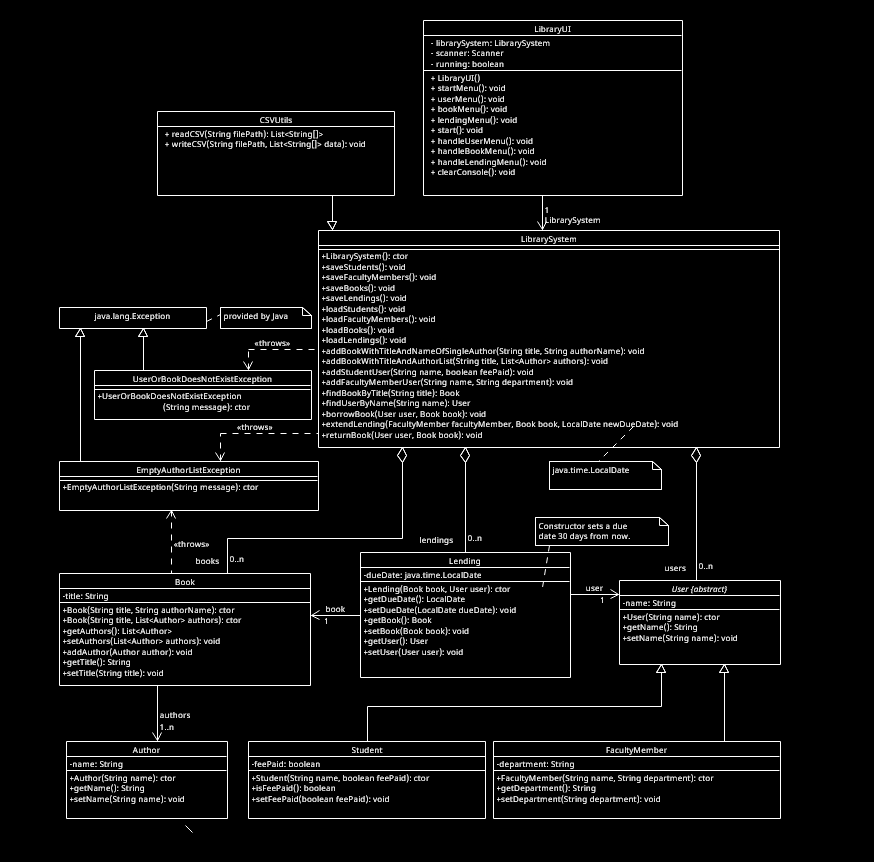

# HÁSKÓLI ÍSLANDS
Iðnaðarverkfræði-, vélaverkfræði- og tölvunarfræðideild  
**HBV202G: Software Design and Construction · Spring 2025**  
Andri Valur Guðjohnsen · Dr. Helmut Neukirchen  
**Software Construction Project**

---

## Objectives
This project focuses on implementing a **Library Management System** with the following features:
- Adding books with authors
- Registering student and faculty users
- Borrowing, returning, and extending lending of books
- Managing lending periods with support for different user types

The project also emphasizes the use of **object-oriented design principles**, **JUnit testing**, and **Maven** for build automation.

---

## Project Structure
The project follows a **Maven** structure and is implemented in **Java 17**. All classes are located in the `is.hi.hbv202g.finalProject` package.

### Key Features
1. **Book Management**
    - Add books with single or multiple authors.
    - Search for books by title.

2. **User Management**
    - Register student and faculty users.
    - Search for users by name.

3. **Lending Management**
    - Borrow and return books.
    - Extend lending periods for faculty members.

4. **Documentation**
    - Javadoc comments for all public methods.
    - UML class diagram for the object-oriented design.

---

## How to Build and Run
### Build
To build the project using Maven, run:
```bash
mvn clean package
```
or 
```bash
./build.sh
```

### Run
To execute the main method you first have to build the project as mentioned above, then use:
```bash
java -jar "target/FinalProject-1.0-SNAPSHOT-jar-with-dependencies.jar"
```
or
```bash
./run.sh
```

---

## Documentation
### Javadoc
The project includes Javadoc documentation. To generate it, run:
```bash
mvn site
```
The generated documentation can be found in `target/site/index.html`.

### UML Class Diagram
A UML class diagram illustrating the object-oriented design is included in the project.  
.

---

## License
This project is licensed under the MIT License. See the [LICENSE](LICENSE.txt) file for details.

---

## Additional Notes
- The project supports **JUnit testing** for all major functionalities.
- The `pom.xml` file is configured to generate a JAR file for easy distribution.
- The UML class diagram highlights the use of design patterns and associations between classes.


